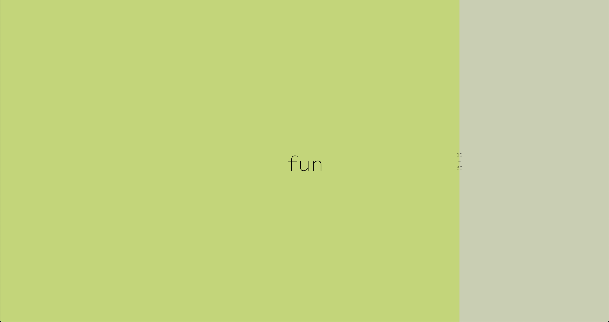

Visual Schedule
===============
- I have found it helpful to have a screen that just shows my schedule as I work each day.

- You can create your own schedule csv based on `this template. <https://docs.google.com/spreadsheets/d/1O-Ixi8d5Gf1nmgDBYvxo0RLJXK1R2jfMXBvSlnuaFuU/edit?usp=sharing>`_

- To see what it looks like in action check out the `live version of my current schedule <https://www.danieljwilson.com/now/>`_.

Screens
=======

There are two screens, **Full Schedule** and **Current Event**. Clicking anywhere onscreen alternates between the two.

Screen 1: Full Schedule
-----------------------

.. image:: images/screen1.png
   :width: 300

Screen 2: Current Event
-----------------------

Personalize
===========

To use this template for your own schedule you will need to change the following lines of code:

1. Schedule
-----------

Replace ``schedule2.csv`` with your own schedule in ``csv`` format.
::

    table = loadTable('assets/schedule2.csv', 'csv', 'header');  

2. Timing
-----------

Check how many hours of offset your timezone is from UTC. In this case I was on Summer CET.
::

    var h = date.getUTCHours() + 2;

Contact
=======
daniel.j.wilson@gmail.com
